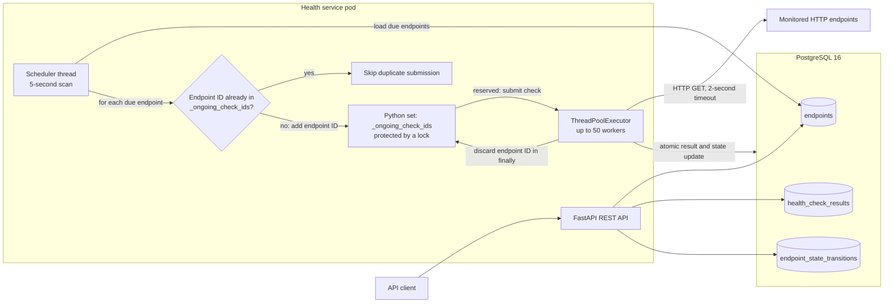

# Health Service MVP Architecture

## Purpose and scope

The health service registers HTTP endpoints, checks them on a configured
interval, records every result, and exposes current state, history, and state
transitions through a JSON REST API.

This document describes the architecture implemented by the MVP. It explains
the datastore choice and the tradeoffs made to keep the service small,
testable, and deployable to a local Kubernetes cluster. Large-scale and
multi-region designs are intentionally outside its scope.

## Runtime architecture

The API and scheduler run in the same Python process and share PostgreSQL as
their source of truth.

The Helm chart deploys one application `Deployment` and one PostgreSQL
`StatefulSet`. The application is exposed by an internal `ClusterIP` Service.
PostgreSQL uses a headless Service and a 1 GiB `ReadWriteOnce` persistent
volume claim. Database credentials and the connection URL are supplied through
a Kubernetes `Secret`.

## Main flows

### Endpoint registration and queries

FastAPI validates registration requests, including the HTTP URL, positive
check interval, and expected status code. Registering an endpoint writes the
configuration with a `pending` state and an initial state-transition record in
one database transaction.

List requests read the materialized current state from `endpoints`. History and
transition requests require a timezone-aware inclusive time range and return
records newest first. Deleting an endpoint also deletes its results and
transitions through foreign-key cascades.

### Scheduling and check execution

The application starts a scheduler thread as part of its FastAPI lifespan. The
scheduler scans PostgreSQL every five seconds for endpoints whose
`next_check_at` is null or due. A newly registered endpoint is therefore
eligible on the next scan.

Due checks are submitted to a bounded pool of 50 threads. The Python set
`_ongoing_check_ids`, protected by a lock, prevents the same endpoint from being
queued twice by this process while an earlier check is still queued or running.
The scheduler adds the endpoint ID before submission, skips it if it is already
present, and the worker discards it in a `finally` block after success or
failure. Each worker performs an HTTP `GET` with a two-second timeout. A check
is healthy only when the response status exactly matches the configured
expected status; HTTP errors retain their response status, while connection
and transport failures store an error message and no status.

After a check completes, its completion timestamp is used to calculate
`next_check_at`. This is fixed-delay scheduling: a slow check shifts the next
execution rather than trying to preserve a wall-clock cadence. It avoids
catch-up bursts but allows execution time and the five-second scan interval to
introduce drift.

### Result persistence and state transitions

PostgreSQL persists a result and updates current state in one transaction:

1. Lock the endpoint row with `SELECT ... FOR UPDATE`.
2. Insert the immutable health-check result.
3. Insert a transition only if the derived state differs from the locked
   current state.
4. Update `current_state`, `last_checked_at`, and `next_check_at` on the
   endpoint.

The row lock prevents two concurrent writes for the same endpoint from
interleaving their state-transition decisions. A database failure rolls back
the whole transaction, so the API never observes a new current state without
its corresponding result.

## Data model

| Table | Responsibility | Important constraints and indexes |
| --- | --- | --- |
| `endpoints` | Configuration, current state, and scheduling timestamps | UUID primary key; positive interval; valid HTTP status; state limited to `pending`, `healthy`, or `unhealthy` |
| `health_check_results` | Append-only history for every attempted check | Foreign key with `ON DELETE CASCADE`; index on `(endpoint_id, checked_at DESC)` for range queries |
| `endpoint_state_transitions` | Initial pending event and subsequent state changes | Foreign key with `ON DELETE CASCADE`; distinct from/to states; index on `(endpoint_id, changed_at DESC)` |

Both composite indexes are created by the current schema initializer. The
history and transition SQL does not name them explicitly: PostgreSQL's query
planner can select them automatically because the queries filter by
`endpoint_id`, constrain the timestamp to a range, and order newest first. This
is separate from the scheduler's due-endpoint query, which has no index on
`next_check_at`.

UUIDs allow the application to create identifiers before writing. PostgreSQL
`TIMESTAMPTZ` values preserve unambiguous instants, and the API normalizes query
ranges to UTC.

## Datastore decision: PostgreSQL

PostgreSQL 16 is the MVP datastore for configuration, current state, results,
and transitions.

### Why PostgreSQL fits

- **Atomic state changes:** a result, optional transition, and materialized
  current state can be committed together.
- **Data integrity:** foreign keys and check constraints enforce lifecycle and
  status invariants independently of the application.
- **Required query shape:** the current composite indexes align with the
  endpoint-filtered time ranges and newest-first ordering used by history and
  transition queries.
- **Durability:** the Helm deployment attaches persistent storage to the
  database container.
- **Low operational breadth:** one datastore satisfies both transactional and
  historical-query needs for the MVP and is exercised by the integration test
  with the same PostgreSQL image used by the chart.

### Datastore tradeoffs

PostgreSQL is heavier than an embedded database and needs its own process,
credentials, probes, storage, and backups. The MVP also uses a single database
pod, so it has no database high availability. An ever-growing results table
will eventually require retention, partitioning, archival, or a specialized
historical store; those mechanisms are not part of this implementation.

The main alternatives were less suitable for this MVP:

| Alternative | Advantage | Reason not chosen |
| --- | --- | --- |
| SQLite | Minimal setup and a single local file | Container storage and concurrent API/scheduler access are less representative of the deployed service, and moving to a networked store would be a later migration. |
| Redis | Fast due-work and current-state operations | Durable history, time-range queries, and atomic relational invariants would require additional data modeling or another datastore. |
| Time-series database | Strong retention, compression, and time-based aggregation | It adds operational complexity while endpoint configuration and transactional state changes would still need careful modeling or a second store. |

## Architecture decisions and tradeoffs

### One process for the API and scheduler

Embedding the scheduler in the FastAPI process minimizes components and makes
startup and shutdown straightforward. The tradeoff is coupled availability:
restarting the API also pauses scheduling. Scheduler ownership is only
process-local, so the Helm chart deliberately runs one application replica;
starting multiple replicas would allow duplicate checks because there is no
distributed claim or lease.

### Synchronous I/O with a bounded thread pool

FastAPI handlers use synchronous psycopg calls, and outbound checks use the
standard-library blocking HTTP client. This keeps the code direct and the core
logic easy to unit test. The 50-worker bound prevents unbounded thread creation,
but queued checks can wait when many endpoints become due together. This model
is appropriate for the MVP workload, not for arbitrarily large concurrency.

### PostgreSQL-backed scheduling state

`next_check_at` makes the database the durable schedule record. If the process
restarts, overdue endpoints become eligible on a later scan without rebuilding
an in-memory schedule. The simple query is easy to reason about, but the MVP has
no index on `next_check_at`, no batch limit, and no database-backed claim. Large
endpoint sets would make scans and work bursts increasingly expensive.

### Completion-based intervals and no automatic retries

Scheduling from the completion time prevents overlapping fixed-cadence work
and retry storms. Failed network checks are normal observations: they are
stored as unhealthy and checked again at the configured interval. There is no
separate retry or exponential-backoff policy, so short transient failures are
visible in history but are not retried immediately.

## Operations and observability

- `GET /health` is a liveness signal for the application process.
- `GET /ready` executes `SELECT 1` and returns failure when PostgreSQL is not
  reachable.
- API, scheduler, check outcome, and failure logs are written to standard
  output for collection through Kubernetes logging.

`GET /metrics/` exposes the following service-defined Prometheus metrics:

| Metric | Type | Labels | Meaning |
| --- | --- | --- | --- |
| `health_service_health_checks_total` | Counter | `outcome="response"` or `outcome="no_response"` | Number of executed checks grouped by whether an HTTP status code was received. A mismatched HTTP status is still a `response`. |
| `health_service_scheduler_tasks_pending` | Gauge | None | Checks submitted to the worker pool that have not started executing. The gauge is incremented before submission and decremented when a worker begins. |

The endpoint also includes the standard Python runtime and process collectors
registered automatically by `prometheus-client`; these are not
health-service-specific metrics.

Readiness deliberately covers the service's required datastore, while
liveness does not depend on PostgreSQL so a database outage does not cause an
application restart loop.

## Known MVP limitations

- The application and database each have one replica and no high-availability
  or failover mechanism.
- Scheduler coordination is in memory, so application replicas cannot safely
  be added without duplicate execution.
- Each database operation opens a new connection; there is no connection pool.
- Results and transitions have no retention or archival policy and grow until
  the endpoint is deleted.
- Deleting an endpoint permanently cascades to its history and transitions.
- The due-endpoint scan is unindexed and returns every due row in one query.
