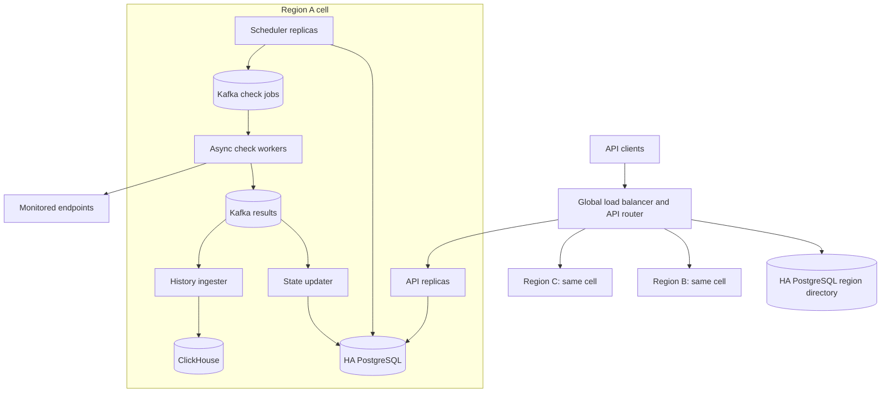

# Scaling to 50,000 Endpoints

## Capacity and goals

With 50,000 endpoints checked every 30 seconds, the service must sustain about
1,667 checks per second and store 144 million results per day. Endpoints are
partitioned evenly across three regions, so each region owns about 16,667
endpoints and runs 556 checks per second. Each regional cell should be sized
for twice that rate to absorb retries, failover traffic, and uneven endpoint
distribution.

The scaled design keeps the existing REST API, but separates its control plane
from check execution. It favors availability and bounded duplication over
exactly-once execution: every scheduled check has an idempotency key, and
duplicate results are safely discarded.

## Deployment topology

Each region runs an independent, multi-availability-zone Kubernetes cluster.
An HA PostgreSQL control-plane directory maps each endpoint ID to its owning
region; endpoint-specific requests are routed there, while list requests fan
out across the three cells. New endpoints are assigned to the least-loaded
healthy region.

API, scheduler, and worker deployments run at least three replicas with pod
anti-affinity, topology-spread constraints, disruption budgets, and rolling
updates. PostgreSQL, Kafka, and ClickHouse are
replicated across availability zones. Each cell's PostgreSQL configuration has
an asynchronous standby in another region. Kubernetes clusters are not
stretched across regions; each cell can operate while another region is
unavailable.

## Compute and scheduling

The current in-process thread pool becomes a regional scheduler and worker
data plane. Scheduler replicas claim due endpoints from the local PostgreSQL
partition in bounded batches using an index on `next_check_at` and
`FOR UPDATE SKIP LOCKED`. Schedules receive stable jitter across the 30-second
window so registrations and recovery do not create bursts.

### Delivery tracking and guarantees

The scheduler uses a few related records and messages. They have separate
purposes rather than representing duplicate copies of the same state:

| Item | Location and lifetime | What it tracks |
| --- | --- | --- |
| Endpoint row | PostgreSQL; one per registered endpoint | Configuration, `next_check_at`, latest state, owning region, and ownership epoch |
| Check occurrence row | PostgreSQL; one per endpoint and scheduled time | One logical check and whether it is `scheduled`, `completed`, or `missed` |
| Outbox row | PostgreSQL; one per occurrence until published | The job payload, publication time, attempt count, and last error |
| Job message | Kafka check-job topic; retained for replay | The occurrence the worker must execute |
| Result message | Kafka result topic; retained for replay | Status, latency, error, and completion time returned by the worker |

For example, suppose endpoint `E1` is due at `12:00:00`:

1. A scheduler locks the `E1` endpoint row. `FOR UPDATE SKIP LOCKED` makes other
   schedulers skip it instead of creating the same occurrence concurrently.
2. In one transaction, the scheduler inserts occurrence `(E1, 12:00:00)`,
   inserts its outbox row, and advances `next_check_at` to `12:00:30`. If the
   process fails before commit, all three changes roll back and `E1` stays due.
3. An outbox publisher sends the payload to Kafka, then records the broker
   acknowledgement on the outbox row. A failure between those actions can
   publish a duplicate but cannot lose the committed occurrence.
4. A worker consumes the job, performs the HTTP request, and publishes a result
   carrying the same occurrence key. It commits the job offset only after the
   result is acknowledged by Kafka, so a crash causes Kafka to redeliver it.
5. Separate state and history consumers update PostgreSQL and ClickHouse. Each
   commits its result offset only after an idempotent write; a reconciler
   retries or alerts on old unpublished outbox rows and incomplete occurrences.

The pair `(endpoint_id, scheduled_at)` is the occurrence key used throughout
this flow. Kafka partitions by endpoint ID so an endpoint's results stay
ordered, while consumer-group offsets track how far each consumer has safely
processed the topics.

This provides at-least-once attempts for jobs that are enqueued and not
superseded. Exactly-once HTTP execution is impossible if a worker crashes after
the request but before recording its result; repeated `GET` checks are safe,
and the occurrence key prevents duplicate results or transitions. Freshness
takes priority during a prolonged backlog: obsolete occurrences are marked
`missed`, and only the newest due occurrence is enqueued.

Workers use asynchronous HTTP I/O, a two-second timeout, bounded concurrency,
and per-host rate limits. At twice the expected regional rate, a two-second
timeout can produce roughly 2,224 concurrent requests, so concurrency and pod
counts must be confirmed by load testing. Workers autoscale on oldest-job age
and queue depth, not CPU alone.

## Storage and retention

Regional PostgreSQL stores endpoint configuration, check occurrences,
materialized current state, state transitions, and the transactional outbox.
Connection pooling, batched writes, and table partitioning replace the MVP's
connection-per-operation model. State updates apply only when `scheduled_at`
is newer than the stored `last_checked_at`, so delayed results cannot overwrite
newer state.

Raw check history is written through the Kafka result topic to replicated
ClickHouse, partitioned by day and ordered by endpoint ID and check time. This
query shape matches the existing endpoint-and-time-range history API. The
default policy keeps raw results for 30 days (4.32 billion rows), hourly
availability aggregates and transitions for 13 months, and compressed Parquet
archives in S3-compatible object storage for one year. Retention is enforced
with table TTLs and object lifecycle rules rather than application deletes.

## Failure modes and recovery

- **Scheduler or publisher failure:** an uncommitted scheduler transaction
  rolls back and leaves the endpoint due; committed outbox rows remain
  available to publish.
- **Worker failure or duplicate delivery:** uncommitted queue messages are
  replayed, while the idempotency key prevents duplicate stored results and
  transitions.
- **Kafka outage:** outbox rows retain new jobs until Kafka recovers; consumer
  groups resume results from their last committed offsets.
- **PostgreSQL or ClickHouse outage:** regional HA handles node loss. The queue
  buffers results during a storage outage, and alerts fire on queue age and
  state freshness.
- **Regional outage:** the global directory assigns affected endpoints to a
  warm standby region with a higher ownership epoch. Replicated configuration
  rebuilds schedules; epoch checks fence late work from the failed region.
- **Slow or failing targets:** timeouts, concurrency limits, and per-host rate
  limits prevent one target from exhausting the worker fleet.

Key alerts cover scheduler lag, unpublished-outbox age, Kafka consumer lag,
expected versus completed checks, missed checks, storage errors, state
freshness, and regional capacity. Recovery is validated with load tests at
twice normal traffic and failure drills for pod, datastore, queue, and
full-region loss.
